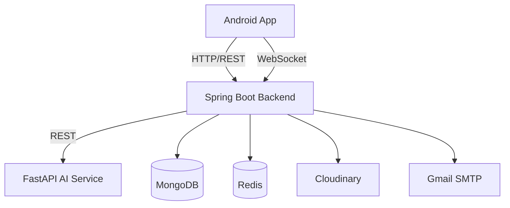

# Instabond

[](https://www.oracle.com/java/)
[](https://spring.io/projects/spring-boot)
[](https://developer.android.com/)
[](https://www.python.org/)
[](https://fastapi.tiangolo.com/)
[](https://www.mongodb.com/)
[](https://redis.io/)
[](https://www.docker.com/)
[](https://cloudinary.com/)
[](https://fastapi.tiangolo.com/)

Instabond is a mobile social media application built with a native Android client, a Spring Boot backend, and a FastAPI AI microservice. The project focuses on content sharing, social interaction, and AI-assisted posting on top of a clean multi-service architecture that is easy to explain, extend, and demo.

## Quick Overview

- Core platform: Android app + REST API + WebSocket + AI microservice
- Goal: simulate a modern social media ecosystem with intelligent support during content creation
- Deployment style: local development with 3 services running in parallel
- Storage and media: MongoDB + Cloudinary
- Authentication: JWT access token / refresh token

---

## Project Highlights

- User registration, login, and password recovery with email OTP
- Newsfeed, posts, likes, comments, shares, bookmarks, and personal profiles
- Stories, story viewers, and interaction flows similar to real social apps
- Real-time 1-to-1 chat using STOMP WebSocket, with inbox and online presence
- User/post search, search history, and friend suggestions
- Full social relationship flow: follow, private account, follow request, close friend, block/unblock
- Profile sharing through deep links and QR flow inside the Android app
- AI-powered posting support:
    - Music suggestions from images
    - User tag suggestions from face analysis
    - Batch image embeddings
- Built-in image editing flow before posting stories or posts
- Swagger documentation available for both backend and AI service

---

## System Architecture



### 1. Android app

- Language / UI: Java, Android View System, ViewBinding, DataBinding
- Client architecture: Activity + Adapter + Repository + ViewModel
- Main libraries:
    - Retrofit + Gson for REST API communication
    - OkHttp interceptor for attaching JWT tokens
    - Glide for image loading
    - LiveData / ViewModel
    - STOMP Protocol Android + RxJava for real-time chat
    - ZXing for QR / profile sharing flow
- Default backend URL in emulator: `http://10.0.2.2:8080/`

### 2. Backend

- Platform: Spring Boot 4, Java 21
- Main components:
    - Spring Web
    - Spring Security + JWT
    - Spring Data MongoDB
    - Spring WebSocket
    - Spring Validation
    - Spring Mail
    - Springdoc OpenAPI
    - Redis support for presence, optional
- Major business capabilities:
    - Auth, refresh token, forgot/reset password
    - Post management, feed, interactions, and bookmarks
    - Stories and story viewers
    - Chat, conversations, message REST API + WebSocket
    - Notifications
    - Search and search history
    - User profile, social graph, friend suggestions, block list, close friends
    - Profile resolution via payload / QR / deep link

### 3. AI service

- Platform: FastAPI, Uvicorn, Pydantic
- Main routes:
    - `POST /api/ai/suggest-music`
    - `POST /api/ai/suggest-tags`
    - `POST /api/ai/embeddings`
- AI libraries currently used: `transformers`, `torch`, `timm`, `deepface`, `opencv-python`
- Useful for showcasing intelligent features without overloading the main backend

---

## Folder Structure

```text
Instabond/
|- android/          # Native Android app
|- backend/          # Spring Boot REST API + WebSocket
|- ai-service/       # FastAPI AI microservice
|- introduction.md   # Local run and test guide
'- README.md
```

---

## Required Environment Variables

### Backend

| Variable                 | Required | Description                                    |
| ------------------------ | -------- | ---------------------------------------------- |
| `MONGODB_URI`            | Yes      | Example: `mongodb://localhost:27017/instabond` |
| `CLOUDINARY_CLOUD_NAME`  | Yes      | Media upload configuration                     |
| `CLOUDINARY_API_KEY`     | Yes      | Media upload configuration                     |
| `CLOUDINARY_API_SECRET`  | Yes      | Media upload configuration                     |
| `JWT_SECRET_KEY`         | Yes      | JWT signing key                                |
| `MAIL_USERNAME`          | No       | Gmail account used for OTP sending             |
| `MAIL_PASSWORD`          | No       | Gmail app password                             |
| `PRESENCE_REDIS_ENABLED` | No       | Default is `false`                             |
| `REDIS_HOST`             | No       | Default is `localhost`                         |
| `REDIS_PORT`             | No       | Default is `6379`                              |
| `REDIS_USERNAME`         | No       | Redis auth                                     |
| `REDIS_PASSWORD`         | No       | Redis auth                                     |
| `REDIS_SSL_ENABLED`      | No       | Default is `false`                             |

### AI service

- You can create a dedicated `.venv` inside `ai-service/`
- The first run requires package installation and model download
- If you use a local model, no token is required by default
- If you use a custom Florence API/server, you can define:
    - `FLORENCE_API_URL`
    - `FLORENCE_API_TOKEN`

---

## How to Run Locally

The system includes 3 main services and 1 mobile application. You can choose to run quickly with Docker Compose or start each service manually.

### Prerequisites

- JDK 21
- Android Studio + Android SDK
- Python 3.11+
- Docker Desktop (Recommended)
- Local MongoDB
- Maven Wrapper included in the repo
- PowerShell on Windows
- Internet connection for the first AI model download

### Environment Setup

Before running the services, you must configure the environment variables:

1. **Backend**: Copy `backend/.env.sample` to `backend/.env` and fill in your Cloudinary, MongoDB Atlas, and Mail credentials.

2. **AI Service**: Copy `ai-service/.env.sample` to `ai-service/.env` and configure your database and model settings.

### Method 1: Running with Docker (Recommended)

This is the fastest way to start the entire infrastructure (including Redis).

**Configure Environment:** Create a `.env` file at the root directory and fill in Cloudinary, Mail, and JWT information.

**Start:**

```powershell
docker compose up --build
```

Note: If you encounter `instabond-redis` container conflicts, delete the old container before running again.

### Method 2: Manual Startup (For Development)

Recommended startup order: MongoDB -> AI Service -> Backend -> Android App.

#### 1. Database (MongoDB)

Ensure MongoDB is running on port 27017:

```powershell
mongod --dbpath "D:\data\db"
```

#### 2. AI Service (FastAPI)

Service handling Face Tagging and music suggestions.

**First time setup:**

```powershell
cd ai-service
python -m venv .venv
\.venv\Scripts\Activate.ps1
python -m pip install --upgrade pip
python -m pip install -r requirements.txt
```

**Run Service:**

```powershell
python -m app.main
```

#### 3. Backend (Spring Boot)

Service handling main business logic.

Note: If the `.mvn` directory is missing, run `mvn wrapper:wrapper` first.

```powershell
cd backend

# Start
.\mvnw.cmd spring-boot:run
```

#### 4. Android App

1. Open the `android/` folder in Android Studio
2. Wait for Gradle sync to complete
3. Run on Emulator or real device

Or quickly run via CLI:

```powershell
cd android
.\gradlew.bat installDebug
```

### Important Notes

- AI Service: Configuration in `requirements.txt` has been optimized for CPU-only to avoid excessively large image size (~10GB) causing disk overflow
- Redis: `PRESENCE_REDIS_ENABLED` is currently set to `false`. When running with Docker, Redis will automatically be available on port 6379
- Troubleshooting: If you encounter `/.mvn not found` error during Docker build, ensure the `.mvn` directory exists in the backend folder (not blocked by `.dockerignore`)

---

## API Docs and Useful Endpoints

**Service URLs**

| Service | URL / Endpoint | Note |
|:---|:---|:---|
| **Backend API** | `http://localhost:8080` | Default Spring Boot port |
| **AI Service** | `http://localhost:8000` | Backend communicates with AI service via this URL |
| **WebSockets** | `ws://localhost:8080/ws` | Used for real-time features |

**API Documentation**

- Backend Swagger: http://localhost:8080/swagger-ui/index.html

- AI Service Docs: http://localhost:8000/docs

**Mobile Development**

The Android app uses **Build Variants** to manage the `BASE_URL` dynamically.

| Build Variant | Purpose | Base URL |
| :--- | :--- | :--- |
| **debug** (default) | Android Emulator | `http://10.0.2.2:8080/` |
| **phone** | Physical device | `http://<Local-IP>:8080/` |

#### Quick Setup:

1. Switch variant via **Build Variants** window in Android Studio.

2. For **phone** variant: Ensure both PC and device are on the same Wi-Fi network.

3. Update your `Local IP` in the `build.gradle` (if using **phone**)

**Note:** The emulator uses `10.0.2.2` to alias the host machine's `127.0.0.1`.

